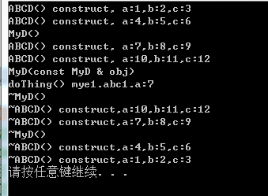

# c++构造函数综合案例

```text
//对象做函数参数
//1 研究拷贝构造
//2 研究构造函数，析构函数的调用顺序
//总结 构造和析构的调用顺序
#include "iostream"
using namespace std;
class ABCD
{ //this（）
public:
    ABCD(int a, int b, int c)
    {
        this->a = a;
        this->b = b;
        this->c = c;
        printf("ABCD() construct, a:%d,b:%d,c:%d  \n", this->a, this->b, this->c);
    }
    ~ABCD()
    {
        printf("~ABCD() construct,a:%d,b:%d,c:%d  \n", this->a, this->b, this->c);
    }
    int getA()
    {
        return this->a;
    }
protected:
private:
    int a;
    int b;
    int c;
};
class MyE
{
public:
    MyE():abcd1(1,2,3),abcd2(4,5,6),m(100)
    {
        cout<<"MyD()"<<endl;
    }
    ~MyE()
    {
        cout<<"~MyD()"<<endl;
    }
    MyE(const MyE & obj):abcd1(7,8,9),abcd2(10,11,12),m(100)
    {
        printf("MyD(const MyD & obj)\n");
    }
protected:
    //private:
public:
    ABCD abcd1; //c++编译器不知道如何构造abc1
    ABCD abcd2;
    const int m;
};
int doThing(MyE mye1)  
{
    printf("doThing() mye1.abc1.a:%d \n", mye1.abcd1.getA());
    return 0;//会调用析构函数，先析构mye1,再析构10,11,12，最后析构7,8,9
}
int run2()
{
    MyE myE;
    doThing(myE);  //调用拷贝构造函数的时候，先调用初始化列表中的构造函数
    return 0;//析构时顺序相反，先析构myE,在析构456，再析构1,2,3
}
//
int run3()
{
    printf("run3 start..\n");
    ABCD abcd = ABCD(100, 200, 300);
    //若直接调用构造函数哪
    //想调用构造函数对abc对象进行再复制，可以吗？
    //在构造函数里面调用另外一个构造函数，会有什么结果？
    //ABCD(400, 500, 600); //临时对象的生命周期
    printf("run3 end\n");
    return 0;
}
int main()
{
    run2();
    //run3();
    system("pause");
    return 0;
}
```

**run2:** 

**run3:** 

